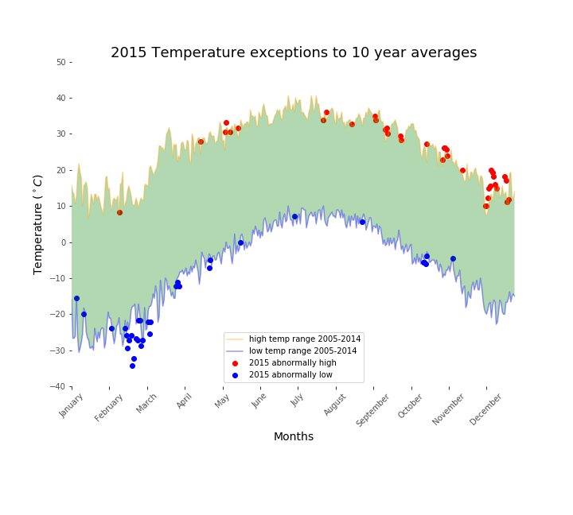

## 
 2015 Temperatures in Context 

This was a demontration project to manage data from the National Climatic Data Center's Global Historical Climatology Network's Daily updates. 

The goal of the project was to present a display of trends in temperature highs and lows from 2005 to 2014 and then show days in 2015 that fell outside of this range.  Matplotlib was the tool useed to build the graphic.

